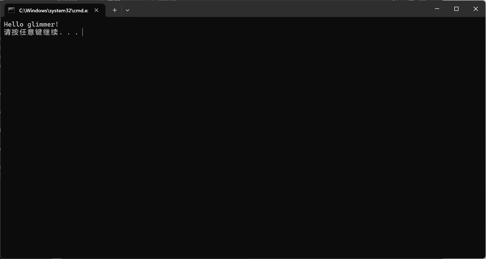
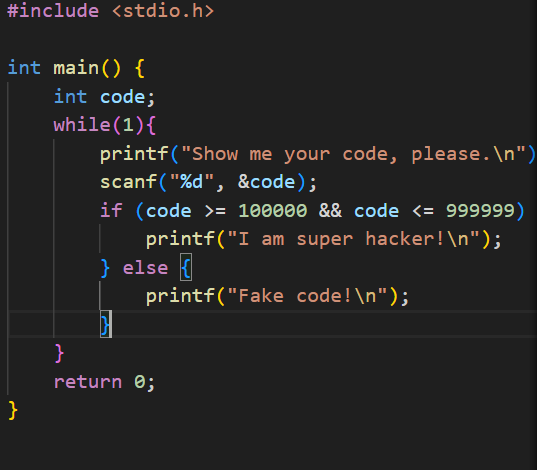

<mark style="background-color：green">第一个程序</mark>  
1.高级语言：  
  优点：相比低级语言高级，语法较清晰，更接近现实语法，更具可读性；  
  缺点：需要先翻译为低级语言，换来的是运行效率更低  
  低级语言：  
  优点：运行效率相对较高，更接近底层；  
  缺点：难理解，可读性差；   
2.第一行：   
  为预处理指令，stdio.h是标准输入输出库，是头文件。   
  下二行；   
  是一个返回值为int，无参数输入的main函数的定义，程序就是在此函数下运行  
  下三行：  
  printf为c语言的输出函数，该语句意为打印Hello,world!  
  下一行：  
  return 0代表程序的终止，返回0这个值，如果不写的话也是默认返回零  
3.return 0;  
  可以不写  
4.32位整数 因为main是函数，函数要有返回值，不然无法运行(理论上返回void也行，但是可能是由于编译的关系要写成int罢?)   
5.  
(外部终端应该也可以吧qwq)  
<mark style="background-color：green">基础语法应用</mark>  
1.cstdio是c++头文件，应改为stdio.h  
2.mian改为main  
3.for改为while  
4.printf("Show me your code,please.")；改为printf("Show me your code,please.\n")；  
5.scanf那里改为scanf("%hd",&code)  
6.||改为&&  
7.else应该放在return 0;上面 并且printf(Fake code!);改为printf("Fake code!\n");  
修改完后大概是这样子:(好像while(true)会报错，我改成while(1)了)（不过好像short范围是-32768~32767吧 不够大 换成int了）  
  

